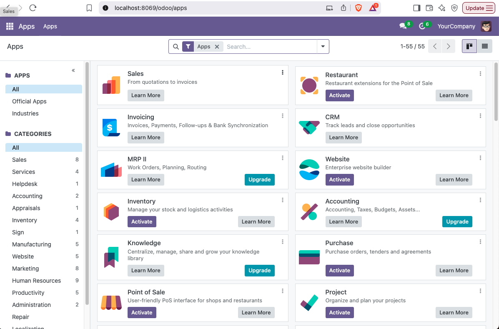

# Dockerized Odoo
Try Odoo, load demo data, preview addons quickly.

## Components
- Odoo 18
- Postgres 17

## Pre-requisites
- Docker version 24.0.6, build ed223bc  or higher

## Local development
- Create `.env` file from `.env.sample` and set `POSTGRES_USER` and `POSTGRES_PASSWORD`. Note that this is different from your Odoo database which will be setup using the Odoo Database Manager
- `docker compose up` to start Odoo
- Access Odoo at`http://localhost:8069/`
- To stop Odoo, `docker compose down`

## Notes
- The Odoo data are persisted in `odoo-data` volume
- The Postgresql DB data are persisted in `db-data` volume
- The installed addons are persisted in the local directory `addons`